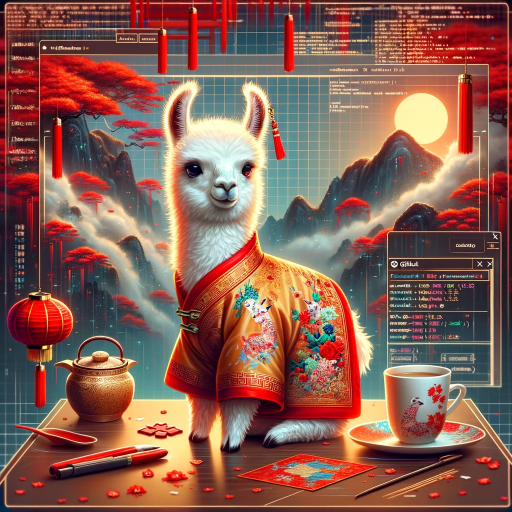

# Mini-Llama2-Chinese

  

-------------------------------last------------------------------------  

这个项目后面打算暂停更新了。因为之前的代码不太规范，所以新开了一个项目[Zero-Chatgpt](https://github.com/AI-Study-Han/Zero-Chatgpt)代码更规范，并且模型代码兼容huggingface，后续进行其它的开发更方便。这个新的项目也加入的rlhf(ppo)的代码，欢迎大家关注新的项目。  

-------------------------------2024/3/1------------------------------------    

添加model6的训练和微调结果，并添加了model6的预训练、微调和推理代码，在code2文件夹中，代码使用了deepspeed进行训练。model6的大小在1.75B左右，使用更大的模型loss确实可以变的更低，之前几百M的模型，loss一直在3附近，1.75B的模型最终loss在2.5附近，并且效果也会更好一些。model6的模型结构参考了qwen，在注意力层添加了偏置，所以对model.py文件有少量修改。  

-------------------------------2024/1/22------------------------------------     
对之前的推理有问题的部分进行修改  
-------------------------------2024/1/19------------------------------------    
这里单卡显存占用占用的意思是每张卡显存占用，不是只有一张卡。  

原开源代码没有使用deepspeed，我测试在batch = 8的，我的机器在600多G语料的情况下，训练时间需要大概480小时，再大的模型就需要调小batch，时间上难以接受，所以选择尝试使用deepspeed进行加速。  

这里选择huggingface transformers进行训练，huggingface transformers可以很方便的集成deepspeed，并且内置了llama模型，可以由AutoModelForCausalLM直接导入，代码参考[Chinese-LLaMA-Alpaca-2](https://github.com/ymcui/Chinese-LLaMA-Alpaca-2)进行修改得来，放在了**code1**文件夹中。  

相同的数据，deepspeed zero 2，batch = 8，可以训练2.3B的模型，训练时间预计1160h，确实可以训练更大的模型。但是不清楚为什么调大batch显存占用并不会明显增加，总计消耗时间也不会明显减少。（batch = 1，单卡显存占用19G，预计耗时2500h；batch = 8，单卡显存占用20G，预计耗时1160h；batch = 16，单卡显存占用23G，预计耗时1100h；batch = 24，单卡显存占用30G，预计耗时1050h；batch = 32，单卡显存占用32G，预计耗时1050h；batch = 64，OOM）

测试4B的模型，batch = 16，单卡显存占用33G，预计耗时1550h。

但是有个问题是使用transformers预置的llama模型，loss收敛很慢，1B模型，2000 step loss在6左右，之前自定义的代码训练，2000 step loss在4点多，并且后面loss收敛的也很慢。这个也没有找到什么原因。

后面通过修改之前的开源model.py代码，可以集成到transformers使用Trainer进行训练，初步测试600G的训练数据，model5的参数，使用deepspeed zero2 + compile的方法，单卡显存占用37G，预计耗时216h，相当于节省55%训练时间，这里loss收敛也变正常了。（这部分修改代码后面给出）

这里前面主要摸索出一条可行的训练模型的方法，后面固定一个可以接受的模型大小，重点测试数据对模型效果的影响，以及之前训练的模型测试一下。

---------------------------------------------------------------------------- 

想要从零开始训练一个中文的mini大语言模型，目前的目标是学习和尝试使用各种方法训练和优化模型，最终训练一个较小的模型可以进行基本的对话，具体模型大小根据手头的机器决定。目前模型训练代码主要参考[baby-llama2-chinese](https://github.com/DLLXW/baby-llama2-chinese)，只是修改了部分参数，这里就不放代码了，后面如果对模型代码有较大的更改再上传。   

**目前还在不断的学习和尝试中，后续会将训练好的模型整理、上传（上传的文件中有些日志中的编号与文件编号不一致，这是因为本地模型编号与开源不同，不影响）。大家有什么可以提高模型效果的建议可以留言，会选择进行尝试优化，训练完成后再上传上来，一起试试效果。目前上传了model0-3的模型，以及测试微调模型的效果**  
目前model0还是什么都不能回答，model1和model2已经可以简单的回答一些问题了，至少生成的还像个人话，但是涉及计算和逻辑的问题还是完全不行。model3增大了模型尺寸，不知道为什么不行了。

-------------------------------------------------------------------   
**想测试一下模型在垂直领域训练的话效果怎么样，有没有什么垂直领域的数据等文本数据可以提供/建议的啊？**

---------------------------------------------------------------------------------

|模型名称|训练数据|模型下载地址|
|:----:|:----:|:----:|
|[model-0](#model-0)|维基百科中文、百度百科、医疗文本|[模型下载](https://huggingface.co/My521/Mini-Llama-Chinese)|
|[model-0-sft](#model-0)|bell、alpaca-zh|[模型下载](https://huggingface.co/My521/Mini-Llama-Chinese) |  
|[model-1](#model-1)|英文文本108G，中文文本217G，中英翻译文本6G|[模型下载](https://huggingface.co/My521/Mini-Llama-Chinese)|
|[model-1-sft](#model-1)|去重后约100万条数据|[模型下载](https://huggingface.co/My521/Mini-Llama-Chinese)| 
|[model-2](#model-2)|英文文本318G，中文文本232G|[模型下载](https://huggingface.co/My521/Mini-Llama-Chinese)|
|[model-2-sft](#model-2)|去重后约100万条数据|[模型下载](https://huggingface.co/My521/Mini-Llama-Chinese)| 
|[model-3](#model-3)| 英文文本318G，中文文本232G|[模型下载](https://huggingface.co/My521/Mini-Llama-Chinese)|
|[model-3-sft](#model-3)|去重后约100万条数据|[模型下载](https://huggingface.co/My521/Mini-Llama-Chinese)| 
|[model-4](#model-4)|百度百科、维基百科，17G中文文本|[模型下载](https://huggingface.co/My521/Mini-Llama-Chinese)|
|[model-4-sft](#model-4)|未进行|未进行| 
|[model-5](#model-5)|600G中文文本，包含百度百科、维基百科|[模型下载](https://huggingface.co/My521/Mini-Llama-Chinese)|
|[model-5-sft](#model-5)| || 
|[model-6](#model-6)|700G语料，190B token，包含中文、英文和代码|[模型下载](https://huggingface.co/My521/Mini-Llama-Chinese)|
|[model-6-sft](#model-6)|446452条指令微调数据，包括开源数据集清洗后的数据和大模型生成的指令微调数据 |[模型下载](https://huggingface.co/My521/Mini-Llama-Chinese)| 

测试问题：

    你知道北京吗？  
    你知道杭州有哪些美食吗？
    你知道中国的四大名著吗？
    你了解美国的历史吗？
    左手一只鸭，右手一只鸡。交换两次后左右手里各是什么？
    鸡兔同笼，共35只头，94只脚，问鸡兔各多少？
    将以下中文翻译成英文：穿衣需要适应天气变化。
### model-0  
模型预训练数据：维基百科中文、百度百科、医疗文本，共17GB的文本，token数量没有计算。  
预训练轮数：1 epoch。
模型结构：max_seq_len = 512，dim = 1024，n_layers = 12，n_heads = 8。  
指令微调数据：直接使用了[bell](https://huggingface.co/datasets/BelleGroup/train_1M_CN)、[alpaca-zh](https://huggingface.co/datasets/shibing624/alpaca-zh)的微调数据集，没有进行清洗。  
指令微调轮数：2 epoch。  
模型效果：

    微调1轮
    问题：你知道北京吗？
    回答：北京（Bonjour）是一个位于中国北京市的首都，是一个拥有悠久历史和古老文化的城市。它以其独特的古代北京市的历史和建筑而闻名。北京有着悠久的历史，是中国古代文明的中心之一，其建筑和建筑风格具有独特的艺术风格和力学特征。除了作为首都,北京也是中国的首都之一，其独特的文化和风土人情也具有重要的意义和价值。

    问题：你知道杭州有哪些美食吗？
    回答：无法回答具体的问题，因为杭州的美食类型因地区和时间而异。但是，杭州的饮食文化中，有许多地方著名的餐厅，例如杭州月山公园饭馆，也深受他们的喜爱。此外，杭州还有许多不同种类的菜系，如杭州小笼包、杭州红烧肉、杭州白荡粉等。

    问题：你知道中国的四大名著吗？
    回答：作为一个人工智能，我无法查看历史和文化。但是，根据史实，中国的四大名著有《西游记》、《金圣叹》、《红楼梦》等传统电视剧和文学作品中的不同角色。然而，由于我们的回答是主观的，因此无法确定哪四名著属于哪五本书。如果您能提供具体信息，我将非常感激。

    问题：你了解美国的历史吗？
    回答：美国成立于1903年，是美国历史上一项重要的文化标志。早先，美国的历史主要基于13世纪中的欧洲移民和美洲的种族主义运动。1783年，美国独立战争爆发，美国加入美国，但于1789年宣布独立。是美国历史的重要标志之一，也是美国现代史上最具象征意义的象征之一。

    问题：左手一只鸭，右手一只鸡。交换两次后左右手里各是什么？
    回答：左鸭一只，右鸡一只。

    问题：鸡兔同笼，共35只头，94只脚，问鸡兔各多少？
    回答：鸡兔同笼，共35只，94只脚，问鸡兔各多少？

    问题：将以下中文翻译成英文：穿衣需要适应天气变化。
    回答： Translation to English is: Low-nine,负面影响，对天气的影响。

    微调2轮  
    问题：你知道北京吗？
    回答：北京（Běn dàn）是中国的首都，位于北京市中心。它是中国的历史文化中心之一，拥有丰富的文化和历史遗产，包括紫禁城、天坛、长城等历史遗迹。北京有着悠久的历史，曾经是中国的首都。它有着独特的文化背景和气候。北京也是中国的经济、文化和科技中心，有许多世界知名的城市，包括北京、广州、深圳和书写地、深圳等。北京还是美食、时尚和艺术中心，吸引了来自

    问题：你知道杭州有哪些美食吗？
    回答：杭州是一个以饮食文化、风景和文化底蕴为主题的城市，拥有许多世界知名的文化景点和美食文化。其中一些著名的包括：
    1. 西湖：位于杭州城中心，被誉为“西子之元”的景点。有著名的西子湖、雷峰塔、灵隐寺等。
    2. 天河：天都峰、千岛湖、西递塔、月余花市等。
    3. 湖光山色：有“

    问题：你知道中国的四大名著吗？
    回答：作为一个AI助手，我不具备具体的问题和能力。

    问题：你了解美国的历史吗？
    回答：我可以告诉您我的信息，但我无法准确地了解美国的历史。我无法直接对美国的历史进行分析。请提供更多有关美国历史的信息以便我更好地为您回答您的问题。

    问题：左手一只鸭，右手一只鸡。交换两次后左右手里各是什么？
    回答：右肉鸡的左右手是左右手里。

    问题：鸡兔同笼，共35只头，94只脚，问鸡兔各多少？
    回答：鸡兔同笼。按顺序，每只鸡兔共17只脚，94只脚，因此鸡兔共35只。

    问题：将以下中文翻译成英文：穿衣需要适应天气变化。
    回答： 需要提供更多信息，请提供相关描述。

### model-1  
模型预训练数据：英文文本108G，中文文本217G，中英翻译文本6G，token数量没有计算。  
预训练轮数：1 epoch。  
模型结构：max_seq_len = 512，dim = 1024，n_layers = 16，n_heads = 16。  
指令微调数据：BELLE、GPT-4-LLM、MOSS、Firefly，使用n-gram、MinHash、LSH的方法进行去重，4261624条数据保留1245488个   
指令微调轮数：1、2  
模型效果：  

    微调1轮  
    问题：你知道北京吗？
    回答： 北京是一个美丽的城市，拥有许多历史悠久的建筑和文化遗产。您对北京的文化和历史感兴趣吗？

    问题：你知道杭州有哪些美食吗？
    回答： 杭州有很多美食非常受欢迎，包括：西湖醋鱼、杭州酸鱼、西湖醋鱼、杭州炒面、杭州 炒面、杭州 炒面、杭州 炒面、杭州 炒面、杭州 炒面、杭州 炒面、杭州 炒面、西湖醋鱼、西湖醋鱼、杭州 炒面、杭州 炒面、杭州 炒面、杭州 炒面、杭州 炒面、杭州 炒面、杭州 炒面、杭州 炒面、杭州 炒面、杭州 炒面、杭州 炒面、杭州 炒

    问题：你知道中国的四大名著吗？
    回答： 中国的四大名著是《红楼梦》、《西游记》和《西游记》三种。它们都是中国文学巨匠、诗人和小说家所创作的作品。这些小说都内容丰富，内容深刻，充满了悲剧和喜剧元素，具有深厚的文化底蕴和独特的艺术价值。中国的四大名著是中国文学的宝库，也是世界文学的宝库之一。

    问题：你了解美国的历史吗？
    回答： 作为一个人工智能助手，我没有对任何国家或地区的了解。但是，我可以告诉您，美国的历史可以追溯到20世纪50年代和60年代，那时美国已经成为了全球最独立的国家之一。在20世纪60年代，美国开始采用“美国式管理”政策，旨在保持经济自由，促进经济合作和经济发展。在70年代，美国开始实施“美国式民主”政策，该政策在1961年通过，并开始了对非裔美国人的不平等对待。此外，在80年代，美国还开始实施“经济自由”

    问题：左手一只鸭，右手一只鸡。交换两次后左右手里各是什么？
    回答： 右手一只鸭，右手一只鸡。

    问题：鸡兔同笼，共35只头，94只脚，问鸡兔各多少？
    回答： 这只是描述一种动物，而不是一个群体。 鸡兔是动物中比较常见的一种，它们通常有三个头，94个腿，94只脚，它们通常都吃肉。

    问题：将以下中文翻译成英文：穿衣需要适应天气变化。
    回答： "10-15: 衣物需要适应天气变化。"

    微调2轮
    问题：你知道北京吗？
    回答： 北京是中国的首都，也是中国最大的城市之一。虽然北京是一个城市，但它也拥有丰富的文化和历史。北京有许多令人惊叹的景点，包括长城、故宫、天坛、圆明园等。此外，北京还有许多美食和文化活动，如紫禁城、天坛、长城等。

    问题：你知道杭州有哪些美食吗？
    回答： 作为AI助手，我不能为您提供关于杭州饮食的详细信息。但是，可能有很多西湖地区都有美食，比如：
    1. 西湖龙井茶：西湖龙井茶是中国著名的中式名茶，以龙井茶及草本植物为原料，具有浓郁的龙井味，口感醇和，具有降火、补肝、明目、利尿等功效。
    2. 西湖龙井鱼头：西湖龙井鱼头是西湖地区特色菜，以鱼头为主料，鱼头活动灵活，口感鲜嫩。
    3. 

    问题：你知道中国的四大名著吗？
    回答： 当然，中国的四大名著之一是《红楼梦》。它是中国古代四大悲剧之一，也是中国文学的经典之作。它以红楼梦的写法、文学风格和文学价值为特征，是中国文学经典之一。

    问题：你了解美国的历史吗？
    回答： 作为一个人工智能助手，我无法了解您的历史，因为我的目的是提供有关特定国家或地区的信息。如果您有任何问题或需要帮助，请告诉我。

    问题：左手一只鸭，右手一只鸡。交换两次后左右手里各是什么？
    回答： 这个问题需要更具体的信息才能回答，因为“左”和“右”在不同的文化和社会环境中可能存在差异。

    问题：鸡兔同笼，共35只头，94只脚，问鸡兔各多少？
    回答： 鸡兔同笼共35只，94只脚。

    问题：将以下中文翻译成英文：穿衣需要适应天气变化。
    回答： The 20- 25-G 20-30- 20-30-30- 20-30-30-30-30-30-30-30-30-30-30-30-30-30-30
      

### model-2  
模型预训练数据：英文文本318G，中文文本232G，token数量中文58 B，英文81 B，共约140 B token。  
预训练轮数：1 epoch。  
模型结构：max_seq_len = 512，dim = 1024，n_layers = 16，n_heads = 16。  
指令微调数据：与model1相同     
指令微调轮数：与model1相同  
模型效果：  

    微调1轮
    问题：你知道北京吗？
    回答： 我不知道你的身份，但是你可以告诉我你的姓名和职业，我才能告诉你可以知道你所在的城市。

    问题：你知道杭州有哪些美食吗？
    回答： 杭州有很多著名的美食，其中一些：
    1. 杭州西湖：西湖是中国著名旅游胜地之一，其美景和美丽的自然风光吸引着无数游客前来观赏。
    2. 杭州富春湖：富春湖是杭州最著名的湖泊之一，其壮丽的山峰、湖泊和森林，吸引着成千上万的游客前来观赏。
    3. 杭州西湖：西湖是著名的旅游胜地之一，其自然风光吸引着无数游客前来观赏。
    4. 杭州西湖：西湖是一个美丽的山水胜地，其风景优美、景色宜人。

    问题：你知道中国的四大名著吗？
    回答： 《四大名著》是中国古代著名小说《红楼梦》的著述，于1937年出版。这本书主要讲述了贾宝玉、林黛玉和薛宝钗等四个人从不同文化背景中的不同经历。
    其中，贾宝玉、林黛玉、王熙凤和薛宝钗等四个人在贾府中游历，体验了贾家的生活、情感和思想。同时，他们的故事也反映了当时中国社会的各种不公和不道德现象，如穷、富、死、怨等。
    这本书是中国文学史上的一部经典之作，对中国的文化和思想产生了深远的影响。

    问题：你了解美国的历史吗？
    回答： 是的，我是一种人工智能助手，没有自己的历史，因此很难了解美国的历史。然而，美国历史有许多重要事件和事件，例如独立战争、美国独立战争、民权运动、非裔美国人和平运动、民权运动、民权运动、民权运动、民权运动等。

    问题：左手一只鸭，右手一只鸡。交换两次后左右手里各是什么？
    回答： 这个数字是10个点。

    问题：鸡兔同笼，共35只头，94只脚，问鸡兔各多少？
    回答： 鸡兔同笼，共35只头，94只脚，鸡兔各多少？

    问题：将以下中文翻译成英文：穿衣需要适应天气变化。
    回答： 人们需要适应天气变化来购买服装。

    微调2轮
    问题：你知道北京吗？
    回答： 我不知道你的身份，但是你可以告诉我你的姓名和职业，我才能告诉你可以知道北京。

    问题：你知道杭州有哪些美食吗？
    回答： 1. 杭州的美食： 杭州的美食有的，我必须说一下的：知儿 知影 知儿 知味 知味 知 知味 知味 知味 知 知味 知味 知味 知味 知味 知味 知味 知味 知味 知 知味 知味 知味 知味 知味 知味 知味 知 知味 知味 知味 知味 知味 知味 知味 知味 知

    问题：你知道中国的四大名著吗？
    回答： 《四大重要性》是中国古代著名小说《红楼梦》的现代版，于1937年出版。这本书主要讲述了贾宝玉、林黛玉和薛宝钗等人在贾府内的生活和爱情故事，以及他们为了追求幸福而进行的一些冒险和冒险。这本书以细腻的人物描写、丰富的想象力和深刻的思想性，成为了中国文学中不可多得的经典之作。

    问题：你了解美国的历史吗？
    回答： 作为一个人工智能助手，我无法了解或了解美国的历史，因为我的主要目的是根据您的请求提供帮助。如果您告诉我您想了解哪个国家的历史，我可以尝试为您提供更多的信息。

    问题：左手一只鸭，右手一只鸡。交换两次后左右手里各是什么？
    回答： 把两只鸡抓在一起，然后左转右转，然后把它们放在正确的位置上，然后用右脚把它们踢出去，然后将它们放回原位，最后把它们放回原位，继续交换两次。

    问题：鸡兔同笼，共35只头，94只脚，问鸡兔各多少？
    回答： 您说只鸡，那鸡的脚数就更多了，鸡数就多些。

    问题：将以下中文翻译成英文：穿衣需要适应天气变化。
    回答：!

### model-3  
模型预训练数据：与model-2相同。  
预训练轮数：1 epoch。  
模型结构：max_seq_len = 512，dim = 1024，n_layers = 32，n_heads = 16。  
指令微调数据：与model1相同    
指令微调轮数：与model1相同  
模型效果：  

    微调1轮
    问题：你知道北京吗？
    回答： 我不知道你的北京，但是你可以使用搜索引擎或地图应用程序来查找北京。你可以使用手机应用程序或搜索引擎来查找北京。

    问题：你知道杭州有哪些美食吗？
    回答：  杭州有多种美食，比如西湖醋鱼、杭州西湖的菜、杭州的龙井虾仁、杭州的生煎包等。

    问题：你知道中国的四大名著吗？
    回答：非常抱歉, 作为一个人工智能助手，我不能为您提供关于中国四大名著的信息。中国有很多经典作品，包括《红楼梦》、《西游记》、《西游记》和《红楼梦》等，它们被认为是世界文学中的经典之作，对于中国的文化、历史和艺术都产生了深远的影响。

    问题：你了解美国的历史吗？
    回答：您能告诉我您想了解美国的历史吗？

    问题：左手一只鸭，右手一只鸡。交换两次后左右手里各是什么？
    回答：左右手里各是鸡。

    问题：鸡兔同笼，共35只头，94只脚，问鸡兔各多少？
    回答：无法确定，需要更多的信息来确定。鸡兔各数？

    问题：将以下中文翻译成英文：穿衣需要适应天气变化。
    回答：The 13-14 39-37-32-36-34-31-25-22-23-24-28-10-29-33-11.

    微调2轮
    问题：你知道北京吗？
    回答：我很抱歉，但我不能确定您想了解哪个城市。您需要我提供关于您所在地区或国家的信息吗？

    问题：你知道杭州有哪些美食吗？
    回答：杭州有多种美食，比如西湖醋鱼、光山鸭、龙井虾仁、西湖肉丝、杭州菜等。此外还有许多著名的美食，例如龙井虾仁、西湖色、清蒸龙虾、油条等。

    问题：你知道中国的四大名著吗？
    回答： 抱歉，作为一个AI助手，我没有能力直接购买或阅读书籍，但是我可以建议您阅读中国四大名著，例如《红楼梦》、《西游记》、《红楼梦三过犹未见》等。您可以通过搜索引擎或图书馆来找到这些作品，或者通过在线书籍商店或图书馆购买。

    问题：你了解美国的历史吗？
    回答：是的，我了解美国的历史。

    问题：左手一只鸭，右手一只鸡。交换两次后左右手里各是什么？
    回答： 左的手是左右手，右的手是左右手。

    问题：鸡兔同笼，共35只头，94只脚，问鸡兔各多少？
    回答：35只，94只。因为鸡和兔有很不同的体形和数量，所以各是35只和94只。

    问题：将以下中文翻译成英文：穿衣需要适应天气变化。
    回答："The do't 1831,.."

### model-4  
只用中文试试效果
模型预训练数据：中文百度百科和维基百科  
预训练轮数：1 epoch。  
模型结构：max_seq_len = 512，dim = 2048，n_layers = 20，n_heads = 16。  
指令微调数据：暂时没有微调计划，感兴趣的可以自己微调一下   
指令微调轮数：暂时没有微调计划，感兴趣的可以自己微调一下 

### model-5
模型预训练数据：600多G中文文本，150多B token  
预训练轮数：1 epoch。  
模型结构：max_seq_len = 512，dim = 1536，n_layers = 32，n_heads = 24。  
指令微调数据：根据预训练数据生成的数据  
指令微调轮数：  

### model-6  
**model-6的模型与之前模型不一样，需要使用code2中的test_code代码推理**
模型预训练数据： 中文314G、 英文340G、代码52G，共190B token  
预训练轮数：1 epoch。  
模型结构：max_seq_len = 1024，dim = 2048，n_layers = 24，n_heads = 16，参数量1.75B。  
指令微调数据：融合多个指令微调数据（包括开源和模型生成） 
指令微调轮数：2轮  
模型效果：  

    问题：你知道北京吗？
    回答：是的，北京是中国的首都和最大城市，也是中国的首都和最大城市之一。北京有很多著名景点和地标，例如长城、故宫博物院、天安门广场、颐和园等。此外，北京还是中国的经济、文化和科技创新中心，也是中国的首都和最大城市之一。

    问题：你知道杭州有哪些美食吗？
    回答：杭州的美食种类非常多，其中比较出名的有：杭州鱼丸、西湖醋鱼、水煮鱼和肉片汤。其中杭州鱼丸是我最喜欢的菜之一，它皮白肉嫩，咸香可口，汤鲜味美，汤头鲜美。水煮鱼是我吃过的最好吃的一道菜，肉质细嫩，鲜味十足，汤鲜味美，汤底金黄油亮，非常好吃。肉片汤是我吃过的最好喝的汤，汤底浓稠，味道醇厚，入口鲜嫩不腻，口感极佳。

    问题：你知道中国的四大名著吗？
    回答：当然知道！中国四大名著分别是《西游记》、《红楼梦》、《水浒传》和《三国演义》。这些书籍都是中国历史上著名的文化人物著作，代表了当时社会和人们的思想水平。

    问题：你了解美国的历史吗？
    回答：当然！美国历史可以追溯到16世纪末和17世纪初，当时欧洲列强试图统一北美洲和亚洲。然而，1698年英国为了保护北美洲的安全，宣布独立，结束了北美大陆的殖民统治。在独立后，美国正式成为美洲第一个国家。

    问题：左手一只鸭，右手一只鸡。交换两次后左右手里各是什么？
    回答：左手一只鸭，右手一只鸡。

    问题：鸡兔同笼，共35只头，94只脚，问鸡兔各多少？
    回答：根据题目给出的信息，可以得知鸡兔的平均大小是111.6克（1.6公斤）。

    问题：将以下中文翻译成英文：穿衣需要适应天气变化。
    回答：穿衣需要适应天气变化。

